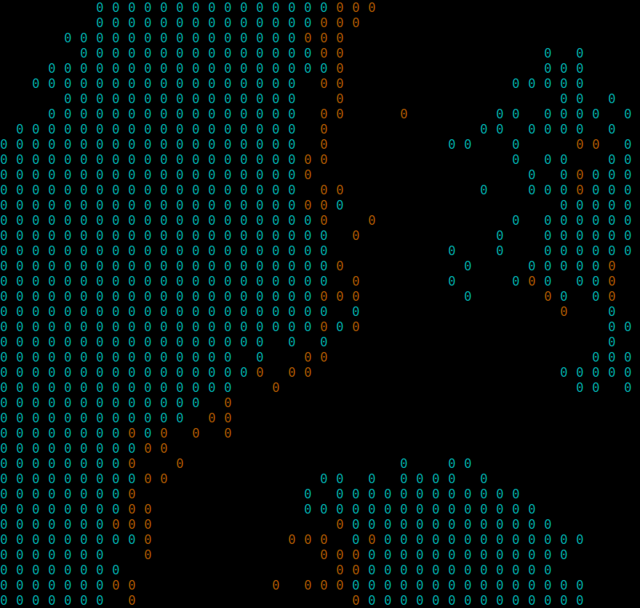
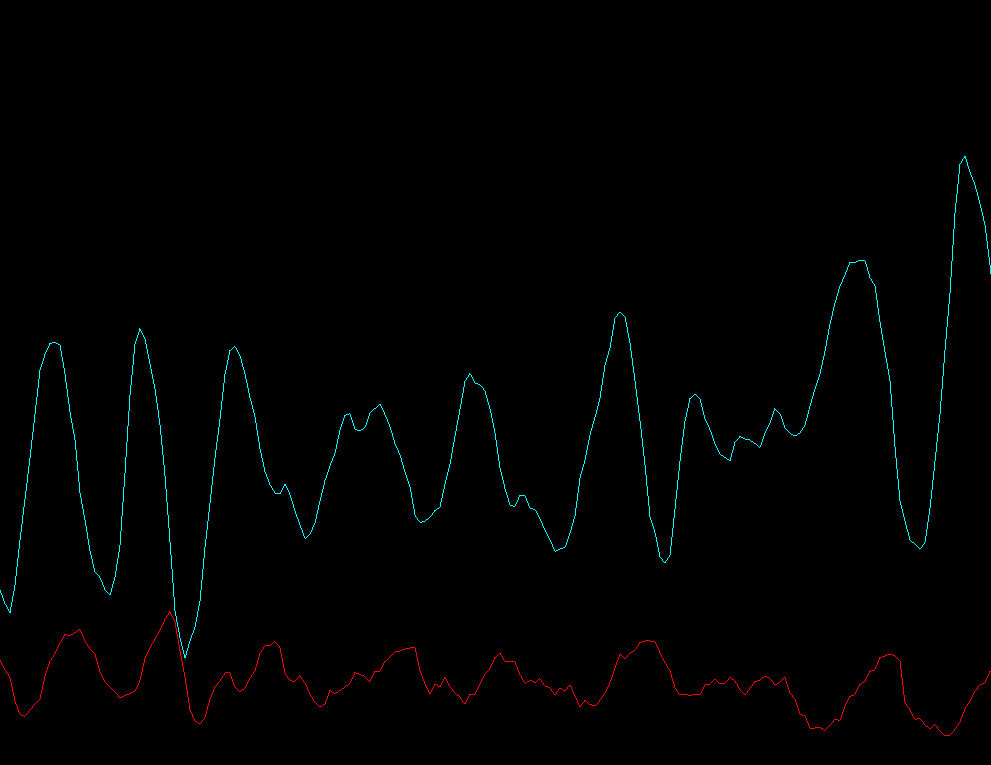

# Predator Prey
2D predator prey simulation using ncurses for displaying the grid and SFML for displaying the population time graph.

# Dependencies
- [SFML 2.3.2] (https://www.sfml-dev.org/)
- [ncurses 6.0] (https://www.gnu.org/software/ncurses/)

# Screenshots

# License
This project is released under MIT License. Please review the [License file](LICENSE) for more details.
